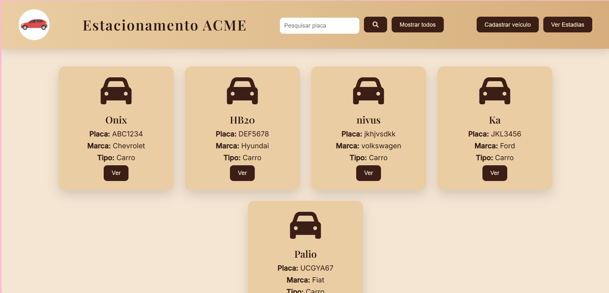
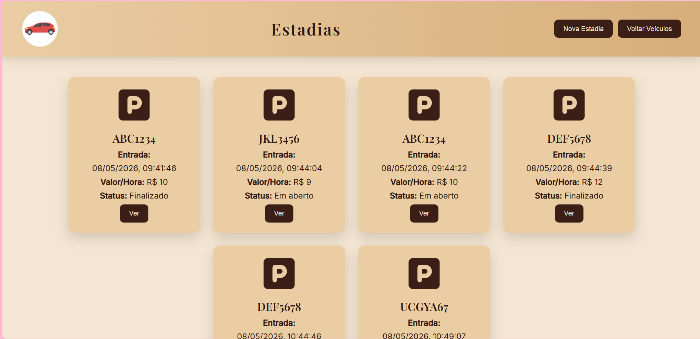
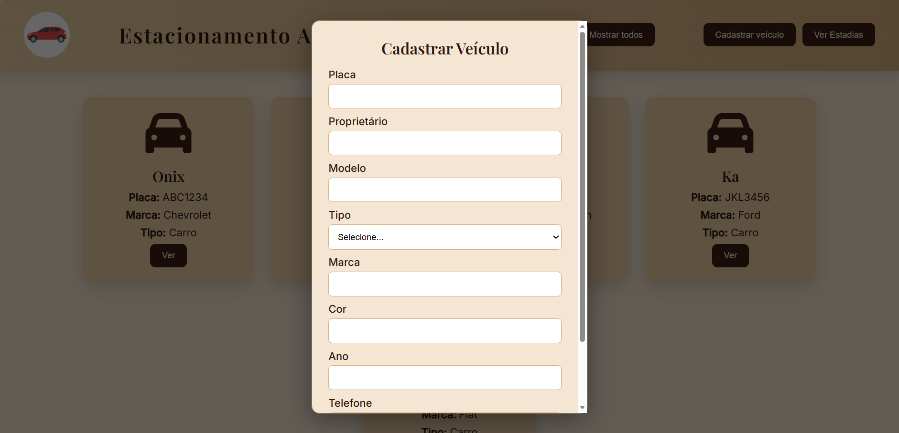
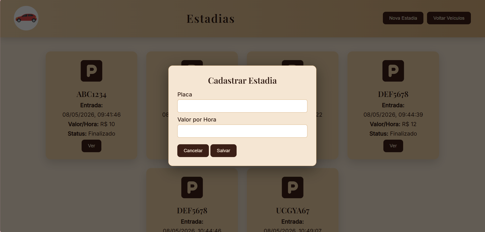
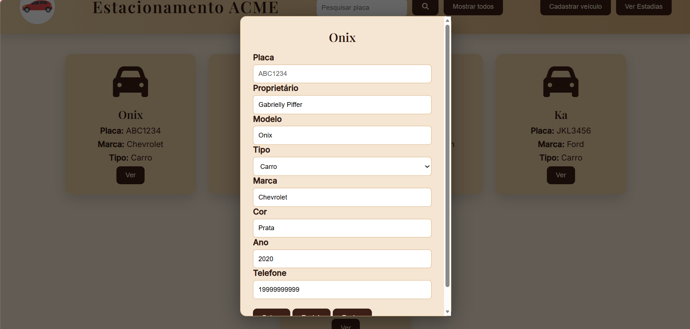
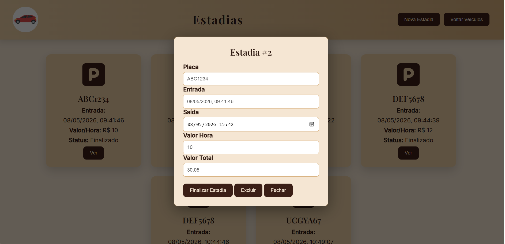
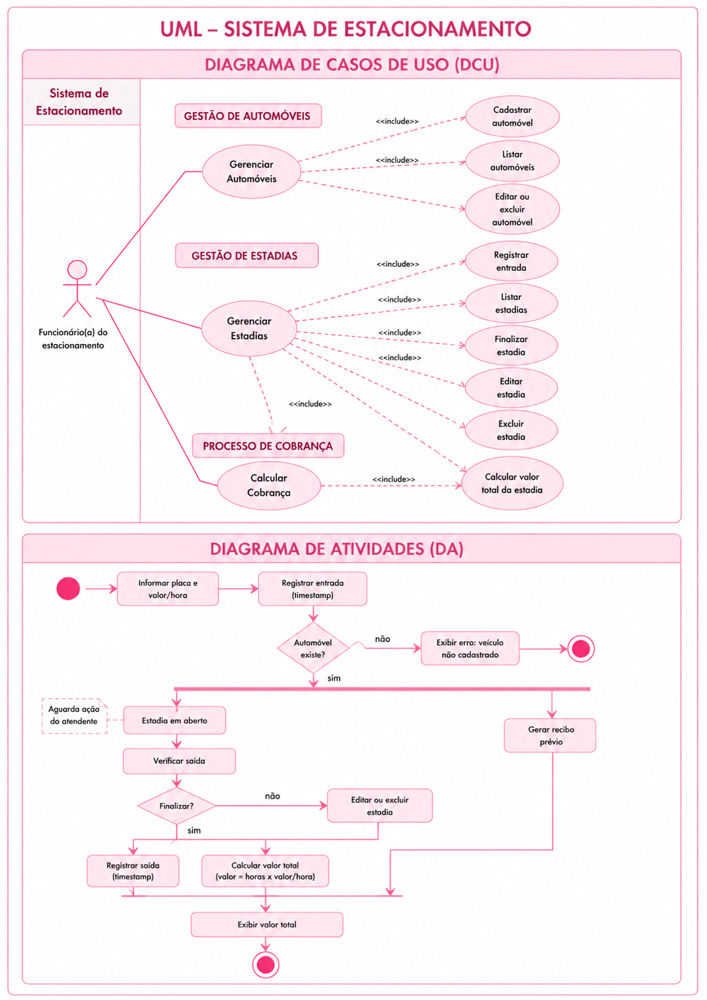

````md id="q7x2nf"
# ESTACIONAMENTO ACME WEB  
### Situação de Aprendizagem - Full-stack  
> Node.JS • JavaScript • VSCode • Prisma ORM • Insomnia

---

# Visual do Sistema

Parte visual da arquitetura e funcionamento do sistema de estacionamento.

## Tela Inicial


## Listagem de Veículos


## Cadastro de Veículo


## Cadastro de Estadia


## Edição de Veículo


## Edição de Estadia


---

# Documentação UML

## Diagrama de Classes (DC)


## Diagrama de Atividades (DA) e Casos de Uso (DCU)


---

# Regras de Negócio

- Todos os veículos devem estar cadastrados no banco de dados.
- O sistema será utilizado apenas pelo atendente.
- Cada estacionamento será registrado como uma estadia.
- A entrada deve ser gerada automaticamente.
- A saída e o valor total iniciam nulos.
- O valor total será calculado automaticamente ao finalizar a estadia.

---

# Tecnologias Utilizadas

- Node.js
- Express
- Prisma ORM
- MySQL
- JavaScript
- HTML5
- CSS3
- VSCode
- Insomnia
- GitHub

---

# Passo a Passo

## Clone o repositório

```bash
git clone https://github.com/GabriellyPiffer/senai-full-stack-estacionamento-2026.git
```

---

## Instale as dependências

```bash
npm install
```

---

## Configure o arquivo `.env`

Crie um arquivo `.env` na raiz do projeto:

```env
PORT=3000
DATABASE_URL="mysql://root@localhost:3306/estacionamento_acme"
```

---

## Execute as migrations do Prisma

```bash
npx prisma migrate dev
```

---

## Inicie o servidor

```bash
npm run dev
```

O servidor estará disponível em:

```txt
http://localhost:3000
```

---

# Abrir o Front-End

Abra o arquivo `index.html` diretamente no navegador  
ou utilize a extensão **Live Server** no VS Code.

---

# Como Utilizar o Sistema

## Cadastro de Veículos

1. Abra o sistema no navegador.
2. Preencha os campos:
   - Placa
   - Proprietário
   - Modelo
   - Tipo
   - Marca
   - Telefone
3. Clique em **Cadastrar Veículo**.

---

## Registro de Estadia

1. Informe a placa de um veículo cadastrado.
2. Digite o valor cobrado por hora.
3. Clique em **Registrar Estadia**.

---

## Finalizar Estadia

1. Localize a estadia ativa.
2. Clique em **Finalizar**.
3. O sistema calculará automaticamente o valor total.

### Fórmula utilizada

```txt
valorTotal = valorHora * (saida - entrada)
```

---

# Funcionalidades

- Cadastro de veículos  
- Busca por placa  
- Registro de entrada  
- Registro de saída  
- Cálculo automático de estadia  
- Edição de registros  
- Exclusão de registros  
- Listagem de estadias  

---
````
